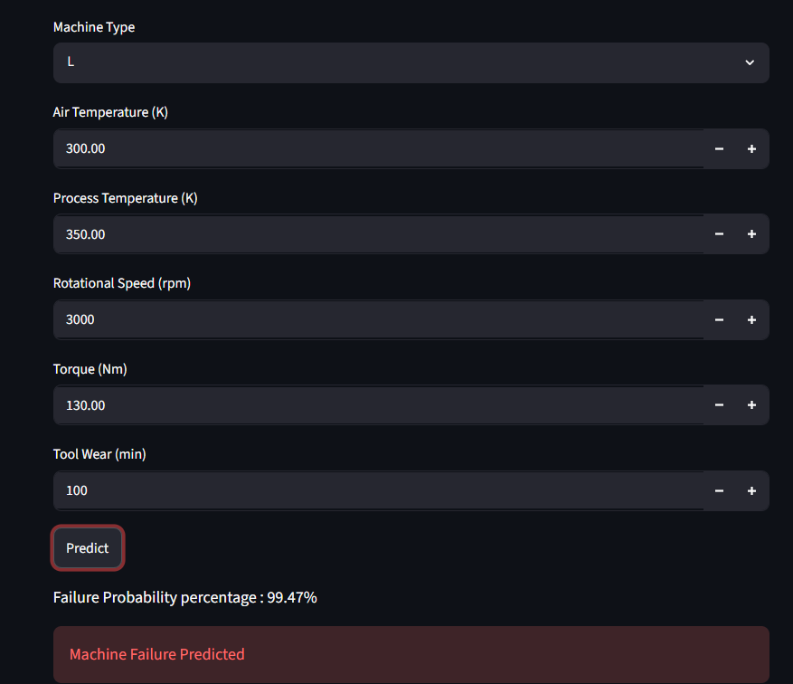
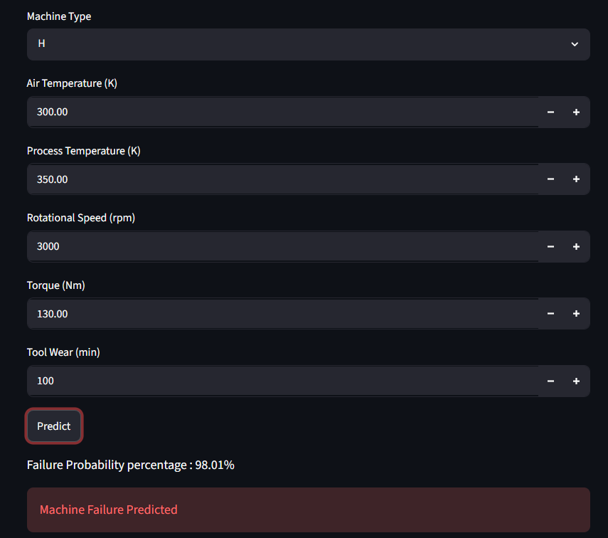
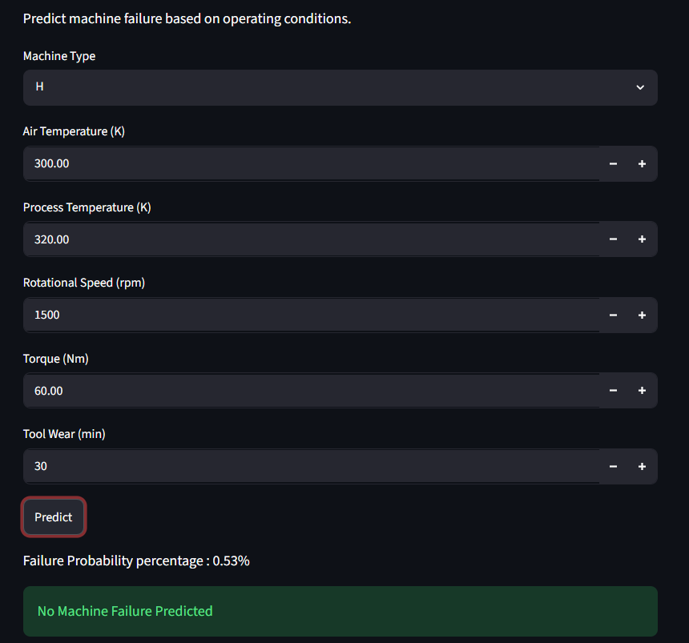
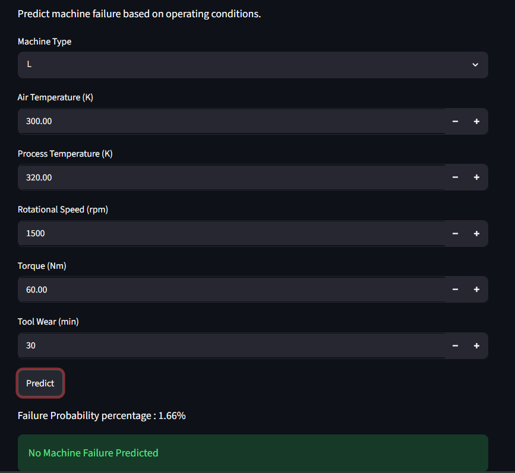

# Predictive Maintenance System

## Overview

This project is an end-to-end Machine Learning application that predicts whether a machine is likely to experience failure based on operating conditions and sensor measurements. The model is trained using the AI4I Predictive Maintenance Dataset and deployed through a Streamlit web application.

## Features

* Data preprocessing and feature engineering
* Exploratory Data Analysis (EDA)
* Machine Learning model training and evaluation
* Saved preprocessing pipeline and trained model
* Interactive Streamlit web interface
* Real-time failure prediction

## Dataset Features

The model uses the following input features:

* Air Temperature
* Process Temperature
* Rotational Speed
* Torque
* Tool Wear
* Machine Type (L, M, H)

## Project Structure

```text
predictive-maintenance/
│
├── app.py
├── requirements.txt
├── README.md
├── model.pkl
├── preprocessor.pkl
│
├── data/
│   └── ai4i2020.csv
│
├── notebooks/
│   ├── eda.ipynb
│   └── model_training.ipynb
│
└── src/
```

## Technologies Used

* Python
* Pandas
* NumPy
* Scikit-Learn
* XGBoost
* LightGBM
* CatBoost
* Streamlit
* Joblib

## Installation

Clone the repository:

```bash
git clone <repository-url>
cd predictive-maintenance
```

Create a virtual environment:

```bash
python -m venv venv
```

Activate the environment:

### Windows

```bash
venv\Scripts\activate
```

### Linux/Mac

```bash
source venv/bin/activate
```

Install dependencies:

```bash
pip install -r requirements.txt
```

## Running the Application

Start the Streamlit application:

```bash
streamlit run app.py
```

The application will open in your browser at:

```text
http://localhost:8501
```

## Here are the images of the predictions





## Model Workflow

1. Load dataset
2. Perform data preprocessing
3. Encode machine type
4. Train machine learning model
5. Save preprocessing pipeline and trained model
6. Load model in Streamlit application
7. Generate predictions from user inputs

## Results

The trained model achieves strong predictive performance on the test dataset and can be used to estimate the likelihood of machine failure from operational parameters.

## Future Improvements

* Hyperparameter tuning
* Model monitoring
* Cloud deployment
* Explainable AI integration (SHAP)
* Docker containerization
* CI/CD pipeline implementation

## Author

Yashwant Narra

## License

This project is intended for educational and learning purposes.
